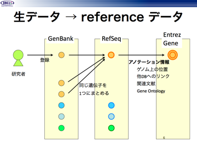
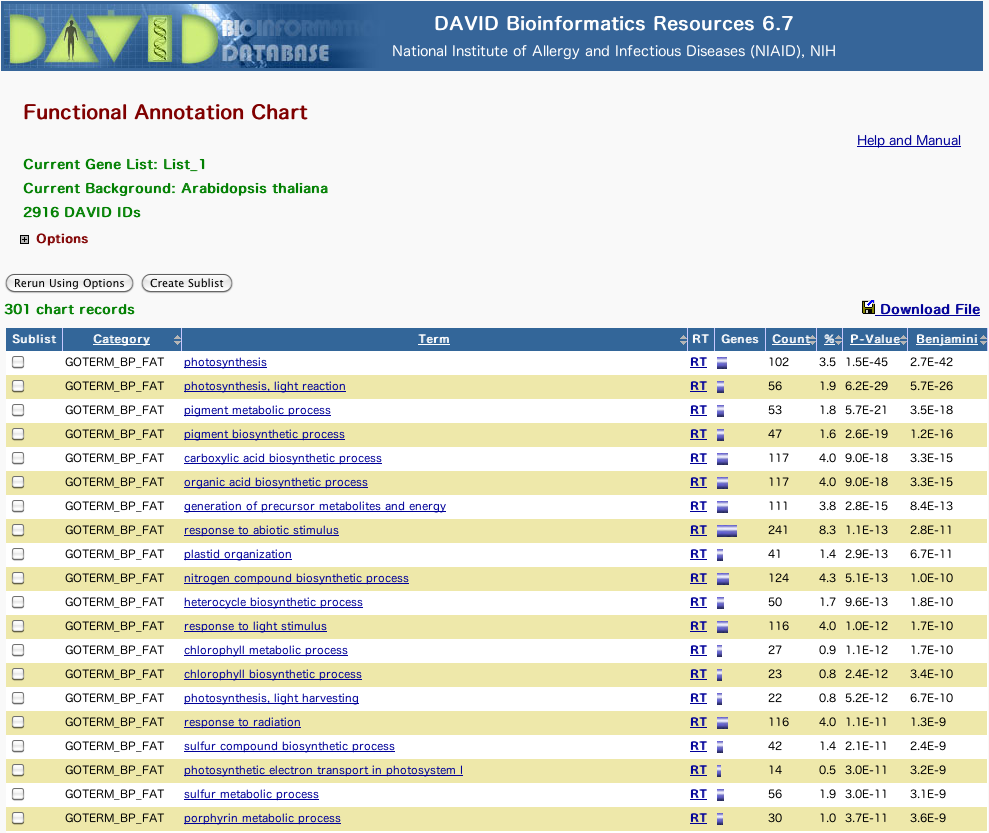

  

目次

<ul class="list1" style="padding-left:16px;margin-left:16px"><li><a href="#u0f5ae55">  講習会のはじめに：参加者アンケート </a></li>
<li><a href="#z4f87418">  DBチュートリアル:統合TV </a></li>
<li><a href="#a668ddeb">  DBカタログ&amp;コンテンツ </a>
<ul class="list2" style="padding-left:16px;margin-left:16px"><li><a href="#h45be91d">  Integbioデータベースカタログ </a></li></ul></li>
<li><a href="#md8b6007">  DB検索 </a>
<ul class="list2" style="padding-left:16px;margin-left:16px"><li><a href="#cb591881">  Google </a></li>
<li><a href="#mbfec250">  生命科学DB横断検索 </a></li>
<li><a href="#u53dd605">  Allie:略語検索エンジン </a></li>
<li><a href="#yeaa6bdc">  核酸配列 </a>
<ul class="list3" style="padding-left:16px;margin-left:16px"><li><a href="#o6ca489b">  GGRNA </a></li></ul></li>
<li><a href="#g6c16a37">  遺伝子発現 </a>
<ul class="list3" style="padding-left:16px;margin-left:16px"><li><a href="#k12a82c3"> 【実習】RefExを使って、組織特異的遺伝子を検索する </a></li>
<li><a href="#ge07a166"> 【実習】DAVIDを用いて、発現データの結果を生物学的に解釈する </a></li>
<li><a href="#d0507d2e">  【参考】NCBI Gene Expression Omnibus (GEO) </a></li>
<li><a href="#a83d5bfe"> 【参考】【実習】GEOを使って、自分の興味のある遺伝子の（ある実験条件下における）発現状況を調べる </a></li>
<li><a href="#ze44dc22"> 【参考】【実習】GEOを使って、自分の興味のあるマイクロアレイ実験データセットを検索&amp;生データをダウンロードする </a></li>
<li><a href="#p112cdc5"> 【参考】【実習】データセットブラウザ(Dataset browser)を利用して、GEOに登録されているマイクロアレイデータを解析する </a></li>
<li><a href="#r4b74645"> 【参考】【実習】GEO2Rを利用して、GEOに登録されているマイクロアレイデータを解析する </a></li></ul></li></ul></li></ul>

<h3 id="content_1_0"><a id="u0f5ae55" href="" title="u0f5ae55">_</a> 講習会のはじめに：参加者アンケート  </h3>
<ul class="list1" style="padding-left:16px;margin-left:16px"><li>おもにMacの人：7人くらい</li>
<li>おもにWindowsの人：大勢</li>
<li>おもにiPadの人：0</li>
<li>iPhoneの人：0
<ul class="list2" style="padding-left:16px;margin-left:16px"><li>そのうちiPhoneでウェブブラウジングメインの人：</li></ul></li>
<li>ウェブブラウザはInternet Explorerの人：40人くらい</li>
<li>ウェブブラウザはFirefoxの人:7人くらい</li>
<li>ウェブブラウザはSafariの人：</li>
<li>ウェブブラウザはChromeの人：</li>
<li>データベースを良く利用する人：</li>
<li>バイオインフォマティクスを使っている人：</li>
<li>プログラミングをたしなむ人：</li>
<li>データベースを構築している人：</li>
<li>データベースを構築したい人：</li>
<li>ライフサイエンス統合データベースセンターの存在を知っていた人：</li></ul>

<h3 id="content_1_1"><a id="z4f87418" href="" title="z4f87418">_</a> DBチュートリアル:統合TV  </h3>

以下に紹介するツールの多くは統合TVでその使い方が動画で紹介されています。是非参考にして下さい。

<blockquote>
<a href="http://togotv.dbcls.jp/ja/" rel="nofollow">http://togotv.dbcls.jp/ja/</a>
</blockquote>

<h3 id="content_1_2"><a id="a668ddeb" href="" title="a668ddeb">_</a> DBカタログ&amp;コンテンツ  </h3>

<h3 id="content_1_3"><a id="h45be91d" href="" title="h45be91d">_</a> Integbioデータベースカタログ  </h3>
<blockquote>
<a href="http://integbio.jp/dbcatalog/" rel="nofollow">http://integbio.jp/dbcatalog/</a>
</blockquote>

文字通り「データベースのデータベース」。日本国内のものが中心。DBの形式、対象、生物種、提供機関などで分類されています。

<ul class="list1" style="padding-left:16px;margin-left:16px"><li>【実習A1】データベースカタログにアクセスし、「一覧を絞り込む」から「ゲノム」のところをクリックし、ゲノム関係のデータベースだけに絞り込まれるのを確認しなさい。</li>
<li>【応用A2】興味あるキーワードで「一覧内を検索する」のフォームからデータベースを検索してみなさい（例えば、「イネ」）。</li>
<li>【応用A3】サムネイルに「休止中」と書かれたデータベースはなぜ休止中となっているか、その理由を考えてみなさい。</li></ul>

<a href="http://togotv.dbcls.jp/20121127.html" rel="nofollow">Integbioデータベースカタログの使い方</a> 

<h3 id="content_1_4"><a id="md8b6007" href="" title="md8b6007">_</a> DB検索  </h3>

<h3 id="content_1_5"><a id="cb591881" href="" title="cb591881">_</a> Google  </h3>
<blockquote>
<a href="http://www.google.co.jp/" rel="nofollow">http://www.google.co.jp/</a>
</blockquote>

Google（「グーグル」と読みます）検索することを「ググる」といいます。そこでインターネット上では、自分でインターネット検索もせずにあれこれと質問をしてくるユーザーに対して以下のようにいうことがあります。

ググれカス

<ul class="list1" style="padding-left:16px;margin-left:16px"><li>【実習B1】<strong>DBCLS</strong>でググりましょう。何件ヒットがありますか？

←こたえは左の+マークをクリックすると出てきます

2013年5月5日現在、約 1,020,000 件

</li></ul>
<ul class="list1" style="padding-left:16px;margin-left:16px"><li>【実習B2】さらに検索窓右上の歯車マークをクリックすると出てくる「検索オプション」をクリックして絞り込みをかけてみましょう。<strong>ドメイン</strong>で<em>.ac.jp</em>を指定すると何件ぐらいに絞り込まれますか？

←こたえ。得られる結果にはどういった特徴があるだろうか？

2013年5月5日現在、約 11,800 件で、ドメインがdbcls.rois.ac.jpのサイトばかりがヒットしてくるといった特徴がある

</li></ul>
<ul class="list1" style="padding-left:16px;margin-left:16px"><li>【応用B3】さらに見るべきヒットを絞り込むにはどういうオプションを指定すればいいだろうか？

←こたえ。

例えば、「キーワードを含めない」オプションで<em>rois</em>を指定してみる

</li></ul>
<ul class="list1" style="padding-left:16px;margin-left:16px"><li>【応用B4】'DBCLS' は「ライフサイエンス統合データベースセンター」の略号であるが、たまに「ライフサイエンス総合データベースセンター」と間違えられる。そう間違えられている例を&quot;で囲うことでインターネット検索エンジンを用いて抽出しなさい。

←こたえ。

&quot;ライフサイエンス総合データベースセンター”でググって、「キーワードを含めない」オプションで<em>ライフサイエンス統合データーベースセンター</em>を指定してみる

</li></ul>

<h3 id="content_1_6"><a id="mbfec250" href="" title="mbfec250">_</a> 生命科学DB横断検索  </h3>

インターネット上のすべてのサイトがググれるわけではありません。グーグルで検索してもググれない状態になっていることを以下のように呼ばれています。

<a href="http://ja.wikipedia.org/wiki/%E3%82%B0%E3%83%BC%E3%82%B0%E3%83%AB%E5%85%AB%E5%88%86" rel="nofollow">グーグル八分</a>

ライフサイエンス分野のコンテンツがググッても出てこないのは、グーグル八分に遭っているからではなく、検索用のインデックスが作成されていないから、です（もちろん、コンテンツがインターネット上で公開されていないからということの方が本邦ではとくに多いのですが）。Googleも学術資料用に<a href="http://scholar.google.co.jp/" rel="nofollow">Google Scholar</a>という特別なサービスを作っていますが、DBCLSではそういったものに頼らずに持続的に日本語を母国語とする我々が使いやすい生命科学データベース横断検索サービスを維持しております。

<blockquote>
<a href="http://biosciencedbc.jp/dbsearch/" rel="nofollow">http://biosciencedbc.jp/dbsearch/</a>
</blockquote>
<ul class="list1" style="padding-left:16px;margin-left:16px"><li>【実習C1】<strong>高血圧</strong>で、1)ググりなさい、2)Google Scholar検索してみなさい、3)生命科学データベース横断検索しなさい。それぞれの検索結果を比較してみなさい。</li>
<li>【実習C2】生命科学データベース横断検索結果の左側に各データベースごとの得られた結果のエントリ数が表示されるので、それらを確認せよ。そして、ハイライト表示されているワードには<strong>高血圧</strong>はもちろんであるが、他のワードもハイライトされているものがあるのを見つけなさい。果たしてそれは何か？

←こたえ。

’hypertension’このように日本語で検索しても英語でのデータベースも同時に翻訳されて検索結果が返ってくるのがこの横断検索の大きな特徴です。

</li>
<li>【実習C3】検索結果を見てみましょう。「医療・薬」の左側の’＋’をクリックして階層を解いてみましょう。さらに「薬」の階層を’＋’をクリックすることで解いてみましょう。どんな「データベース」にどれだけのヒットがあったか、見てみましょう。「GenomeNet内JAPIC」には薬の添付文書の検索結果など、フリーで利用可能なデータベースの検索結果が得られていることを確認し、中身の一部を見てみなさい。</li>
<li>【応用C4】いわゆる「データベース」以外にも、蛋白質・核酸・酵素の過去記事や、文科省「ゲノム」特定領域研究の報告書といった、日本語の文献もヒットしてきていることを確認し、中身の一部を見てみなさい。</li>
<li>【応用C5】自分の研究テーマに関係のあるキーワード（例えば<strong>シロイヌナズナ</strong>）や指導教員の名前（例えば<strong>朽津和幸</strong>）で検索してみなさい。どういういったデータベースのどのエントリがヒットしてくるか？</li></ul>

<a href="http://togotv.dbcls.jp/20110223.html" rel="nofollow">生命科学データベース横断検索を使い倒す</a> 

<h3 id="content_1_7"><a id="u53dd605" href="" title="u53dd605">_</a> Allie:略語検索エンジン  </h3>
<ul class="list1" style="padding-left:16px;margin-left:16px"><li>【実習D1】'SPF'でググリなさい。どういったことが起こるか？

←こたえ。

例えば、'DBCLS'でGoogle検索しても「ライフサイエンス統合データベースセンター」以外の'DBCLS'はインターネット上にそれほどないため困らないのであるが、短い略語の場合は同義語がインターネット上に多数存在して調べたい情報に行き着くまでに非常に苦労することになります。

</li></ul>

つまり、こういうことです。

<a href="donotgoogle.jpg" rel="nofollow">ググるなあぶない</a>

<blockquote>
<a href="http://allie.dbcls.jp/" rel="nofollow">http://allie.dbcls.jp/</a>
</blockquote>
<ul class="list1" style="padding-left:16px;margin-left:16px"><li>【実習D2】Allieを用いて'SPF'を検索してみなさい。共起している略語やその略語の専門分野を見ることで、1)実験用マウスを飼う環境を意味する'SPF'、2)日焼け止めクリームに書いてある'SPF'の略す前の形(long form)を調べよ。

←こたえ。

1)specific pathogen-free 2)sun protection factor

</li></ul>
<ul class="list1" style="padding-left:16px;margin-left:16px"><li>【実習D3】Allieを用いて'iPS'を検索してみなさい。何年からこの略語は使われだしたか？ここで調べる限り、いくつの論文がこの略語を用いているか？またその論文のリストを表示せよ。

←こたえ。

'induced pluripotent stem'を意味するiPSという語は2007年から860の論文中に出現している(2013年5月5日現在)。それらの論文でよく一緒に使われている略語は'ES'である。

</li></ul>
<ul class="list1" style="padding-left:16px;margin-left:16px"><li>【応用D4】自分の研究分野でよく使われている略語を入力し、他の分野ではどういった意味に使われているか調べてみなさい。</li></ul>

<a href="http://togotv.dbcls.jp/20100831.html" rel="nofollow">Allieを使って略語の正式名称を検索する2010</a> 

<h3 id="content_1_8"><a id="yeaa6bdc" href="" title="yeaa6bdc">_</a> 核酸配列  </h3>

GenBankやRefSeqなどいろいろデータベースが存在して混乱気味なので以下にまとめます。

</a>

<ul class="list1" style="padding-left:16px;margin-left:16px"><li>どんなデータが?
<ul class="list2" style="padding-left:16px;margin-left:16px"><li>GenBank … 研究者が登録した配列（生データ）</li>
<li><a href="http://www.ncbi.nlm.nih.gov/RefSeq/" rel="nofollow">RefSeq</a> … GenBank に登録された配列を、NCBIがまとめてreferenceとしてまとめたもの
<ul class="list3" style="padding-left:16px;margin-left:16px"><li>元来は、登録される配列は断片であったので（昔のDNAシーケンサーは長く読めなかった and/or つないでいない）</li></ul></li>
<li>Entrez Gene … RefSeq の配列に対して、外部リンク、ゲノム上の位置、遺伝子名、Gene Ontology（機能を表す用語）などのアノテーション情報をつけたもの</li></ul></li>
<li>コメント
<ul class="list2" style="padding-left:16px;margin-left:16px"><li>GenBankもRefSeqもNucleotide (GenBank)から検索できます</li>
<li>RefSeqは、アクセッション番号が、NM_#########、NC_#########、XM_#########などになっています。</li>
<li>結局：RefSeqにデータがあればよいですが、微生物系はキビシイかも</li>
<li>参考:昔、キーワード検索をしたら、同じ名前の全然 違う遺伝子のデータをダウンロードしてしまい、論文出版後に再現性がとれないとクレームがついた事件があったりしたので、検索は十分に気をつけましょう。</li></ul></li></ul>
<ul class="list1" style="padding-left:16px;margin-left:16px"><li>【実習E1】Entrez Geneで'SOD'と遺伝子名で検索しましょう。
<blockquote>
<a href="http://www.ncbi.nlm.nih.gov/nuccore" rel="nofollow">http://www.ncbi.nlm.nih.gov/nuccore</a>
</blockquote></li></ul>

検索結果の各エントリの'FASTA'のリンクをクリックすると塩基配列がFASTAフォーマットで得られます。ここからいろんな生物種のSODとアノテーションされた核酸配列を集めることが可能です。
実に多くのエントリがひっかかってきますが、すべてが完全長(complete cds)ではなく、またRefSeqだけでなくGenBankの配列もまじっていることを確認しましょう。

<h4 id="content_1_9"><a id="o6ca489b" href="" title="o6ca489b">_</a> GGRNA  </h4>

RefSeqのある生物種に対して超高速に検索できるようにしたDBCLS謹製のサービス。

<ul class="list1" style="padding-left:16px;margin-left:16px"><li>【実習E2】ヒトの遺伝性乳がんに関与しているといわれている遺伝子<em>BRCA2</em>をGGRNAで検索しましょう。そのアミノ酸配列をエントリ中から探し出しましょう（ヒント：CDSの項目の、translation=のところに書かれています）。</li>
<li>【応用E3】上で探しだしたヒト<em>BRCA2</em>のアミノ酸配列をクエリとして相同な遺伝子を配列類似性(BLAST)検索しましょう。データベースとしてはアミノ酸配列セットを用い、検索プログラムにはBLASTPを選びましょう。
例えば、シロイヌナズナの配列セットに対して検索する場合にはTAIR BLAST、</li></ul>
<blockquote>
<a href="http://www.arabidopsis.org/Blast/" rel="nofollow">http://www.arabidopsis.org/Blast/</a>
</blockquote>

ユーカリの配列セットに対して検索する場合にはかずさDNA研究所のEucalyptus camaldulensis Genome DatabaseのBLAST検索

<blockquote>
<a href="http://www.kazusa.or.jp/eucaly/search.html#similarity" rel="nofollow">http://www.kazusa.or.jp/eucaly/search.html#similarity</a>
</blockquote>

を使うほうがオリジナルのNCBI BLAST

<blockquote>
<a href="http://www.ncbi.nlm.nih.gov/blast/" rel="nofollow">http://www.ncbi.nlm.nih.gov/blast/</a>
</blockquote>

よりも使い勝手がよいようです。

この操作によりヒト遺伝子<em>BRCA2</em>のhomologがシロイヌナズナとユーカリにおいて見いだせますが、前者はヒットした遺伝子にきっちりとBRCA2 homologと書かれていましたが、後者はそうではありませんでした。このように<strong>遺伝子アノテーションは最初から整備されているものではなく、データベースとして維持管理して初めて享受できるもの</strong>です。データベースを管理してくれている人たちに感謝して利用しましょう。

<h3 id="content_1_10"><a id="g6c16a37" href="" title="g6c16a37">_</a> 遺伝子発現  </h3>

<h4 id="content_1_11"><a id="k12a82c3" href="" title="k12a82c3">_</a> 【実習】RefExを使って、組織特異的遺伝子を検索する  </h4>
<ul class="list1" style="padding-left:16px;margin-left:16px"><li><a href="http://refex.dbcls.jp/" rel="nofollow">RefEx </a>は、DBCLS が提供する、4つの異なる実験手法（EST、GeneChip、CAGE、RNA-seq）によって得られた40種類の正常組織における遺伝子発現量を並列に表現することで、手法間の比較とともに各遺伝子の発現量を直感的に比較することが可能な、リファレンス(参照)データセットです。</li></ul>
<blockquote>
<a href="http://refex.dbcls.jp/" rel="nofollow">http://refex.dbcls.jp/</a>
</blockquote>
<ul class="list1" style="padding-left:16px;margin-left:16px"><li>キーワード・遺伝子名検索では逐次的に検索語候補が提示される</li>
<li>『転写因子』や『Gタンパク質共役受容体』などのようなあるカテゴリーに属した遺伝子群についてまとめて検索可能</li>
<li>『組織特異的遺伝子』をワンタッチで検索</li></ul>
<ul class="list1" style="padding-left:16px;margin-left:16px"><li>1. <a href="http://refex.dbcls.jp/" rel="nofollow">http://refex.dbcls.jp/</a>を開きます。</li>
<li>2. 画面中央の「組織特異的に発現する遺伝子を見る」の臓器アイコンにカーソルを合わせると、更に詳細な部位のアイコンが出るので、調べたい臓器（例は肝臓）をクリックします。</li>
<li>3. 一覧表示画面では、左のバーから「絞り込み検索」や「ソート項目」の切り替えができます。</li>
<li>4. 「Download」アイコンをクリックすると検索結果のタブ区切りテキストがダウンロードされます。</li>
<li>5. 各遺伝子の青字の部分（例 <a href="http://refex.dbcls.jp/gene_info.php?lang=ja&amp;db=human&amp;geneID=2243&amp;refseq=NM_000508&amp;unigene=Hs.351593&amp;probe=205649_s_at" rel="nofollow">fibrinogen alpha chain</a>）をクリックすると詳細情報を閲覧できます。</li>
<li>6. 「ヒートマップ on Bodyparts3D」では、表示する部位の切り替え（全身・体幹部・頭部）ができます。「皮膚・骨格筋を表示」もしくは「アニメーション表示」にチェックを入れるとどのように表示されるでしょうか。</li>
<li>7. 「組織40分類別データ」では、バーの上にマウスオーバーすると測定部位と発現値が表示されます。</li>
<li>8. 「Download」をクリックすると、表示中の遺伝子の組織40分類別の発現データがタブ区切り形式でダウンロードできます。</li>
<li>9. 「Probe set ID」のリンク先をクリックすると、どういう情報が参照できるでしょうか。</li>
<li>10. オーソログ対応遺伝子について、ヒトとマウスで比較してみましょう。どのような違いがあるでしょうか。</li>
<li>11. 自分の研究テーマに関連する、また興味のある遺伝子について検索してみましょう。</li></ul>

<h4 id="content_1_12"><a id="ge07a166" href="" title="ge07a166">_</a> 【実習】DAVIDを用いて、発現データの結果を生物学的に解釈する  </h4>
<dl class="list1" style="padding-left:16px;margin-left:16px"><dt>DAVID</dt>
<dd>The Database for Annotation, Visualization and Integrated Discovery</dd></dl>
<blockquote>
<a href="http://david.abcc.ncifcrf.gov/" rel="nofollow">http://david.abcc.ncifcrf.gov/</a>
</blockquote>
<ul class="list1" style="padding-left:16px;margin-left:16px"><li>マイクロアレイ実験の一般的な目的は、実験条件によって得られたある遺伝子群の発現が生物学的にどういう意味を持つかを考えることです。

</a>

</li>
<li>今回は、その方法の一つとして、マイクロアレイの結果に<a href="http://www.google.co.jp/url?sa=t&amp;source=web&amp;cd=4&amp;ved=0CEEQFjAD&amp;url=http%3A%2F%2Fja.wikipedia.org%2Fwiki%2F%25E9%2581%25BA%25E4%25BC%259D%25E5%25AD%2590%25E3%2582%25AA%25E3%2583%25B3%25E3%2583%2588%25E3%2583%25AD%25E3%2582%25B8%25E3%2583%25BC&amp;ei=ve9QTd6XMtG6cbeW1KUH&amp;usg=AFQjCNF8U-O4ktlMGoR9DNC0wKltmbjtmw" rel="nofollow">Gene Ontology</a>の用語を付与することで、生物学的な解釈を行います。</li>
<li><a href="http://togotv.dbcls.jp/20120927.html#p01" rel="nofollow">【復習用】DAVIDを使ってマイクロアレイデータを解析する 2012</a> </li></ul>
<ul class="list1" style="padding-left:16px;margin-left:16px"><li>マイクロアレイデータの準備
サンプルデータとして、<a href="http://www.ncbi.nlm.nih.gov/geo/" rel="nofollow">NCBI GEO</a>より取得した公共の遺伝子発現データを用います。このデータは、ある実験の前後の2群間で有意に発現減少した遺伝子群のリストです。
 
→ <a href="110208_IDlist.txt" rel="nofollow">マル秘遺伝子リスト</a>
 
（右クリックして「新しいタブで開く」もしくは「名前を付けてリンク先を保存」してください。）
 
このデータは、どのような実験から得られたデータなのか、どのように解釈できるのかをDAVIDを使って考察してみましょう！</li></ul>
<ul class="list1" style="padding-left:16px;margin-left:16px"><li>1. 上部メニューの「Start Analysis」をクリックします。</li>
<li>2. 画面左側バーで、probe IDリストをコピペ or ファイルを指定します。</li>
<li>3. リストのIDの種類タイプを選択します。 … 今回は、「AFFY_ID」と「Gene List」</li>
<li>4. Submit List をクリックするとリストが読み込まれます。</li>
<li>5. アップロードしたリストは、左側バーの「List Manager」で「Uploaded List_1」として保存されています。削除やrenameもできます。</li>
<li>6. 解析を続けます。真ん中の「Functional Annotation Tool」をクリックします。</li>
<li>7. 「Gene Ontology」をクリックすると、Gene Ontologyを用いた解析の細かいメニューが表示されます。</li>
<li>8. 今回は、GOTERM_BP_FAT (BP=Biological Process)に注目します。その右の「Chart」をクリックすると結果がポップアップされます。</li>
<li>9. P-value を2回クリックしてp-valueが小さい（統計的に有意である）順にしてみましょう … p-value小さい順は、一度やればしばらく覚えているので、次からはしばらくは必要ないです
<h4>結果</h4>

</a>

</li>
<li>[応用編] Pathways &gt; KEGG_PATHWAY や Tissue Expression &gt; UP_TISSUE なども見てみましょう。生物学的にどういうことが言えるでしょうか。
<h4>サンプルデータの答え</h4>

Arabidopsis thaliana (シロイヌナズナ)の植物細胞と細胞壁分解酵素を用いて取り除いた植物細胞（<a href="http://ja.wikipedia.org/wiki/%E3%83%97%E3%83%AD%E3%83%88%E3%83%97%E3%83%A9%E3%82%B9%E3%83%88" rel="nofollow">プロトプラスト</a>）との比較（＝植物細胞の<a href="http://ja.wikipedia.org/wiki/%E3%82%AB%E3%83%AB%E3%82%B9_%28%E6%A4%8D%E7%89%A9%29" rel="nofollow">脱分化</a>前・後）

</li></ul>

<h4 id="content_1_13"><a id="d0507d2e" href="" title="d0507d2e">_</a> 【参考】<a href="http://www.ncbi.nlm.nih.gov/geo/" rel="nofollow">NCBI Gene Expression Omnibus (GEO)</a>  </h4>

世界最大の遺伝子発現（<a href="http://ja.wikipedia.org/wiki/DNA%E3%83%9E%E3%82%A4%E3%82%AF%E3%83%AD%E3%82%A2%E3%83%AC%E3%82%A4" rel="nofollow">マイクロアレイ</a>）データベース（レポジトリ）

<blockquote>
<a href="http://www.ncbi.nlm.nih.gov/geo/" rel="nofollow">http://www.ncbi.nlm.nih.gov/geo/</a>
</blockquote>
<ul class="list1" style="padding-left:16px;margin-left:16px"><li><a href="http://www.ncbi.nlm.nih.gov/geo/" rel="nofollow">GEO</a>のエントリについて [#lca52056]</li>
<li>GEO ID 番号の最初の3文字が
<pre>    GPL:  プラットフォーム（マイクロアレイ等の型番）
    GSM: サンプル（1枚のマイクロアレイから出たデータ）
    GSE:  シリーズ（1つの実験で出たデータを集めたもの。通常複数の GSM からなる）
    GDS:  データセット（NCBIで比較可能なデータを集めて再編成したもの。GEO上で簡単な解析が可能）</pre>
  </li></ul>

<h4 id="content_1_14"><a id="a83d5bfe" href="" title="a83d5bfe">_</a> 【参考】【実習】GEOを使って、自分の興味のある遺伝子の（ある実験条件下における）発現状況を調べる  </h4>
<ul class="list1" style="padding-left:16px;margin-left:16px"><li><a href="http://togotv.dbcls.jp/20111020.html#p01" rel="nofollow">【復習用】NCBI GEOの使い方2～遺伝子プロファイルの検索・処理済みデータの取得～ 2011</a> </li>
<li>1. <a href="http://www.ncbi.nlm.nih.gov/geo/" rel="nofollow">http://www.ncbi.nlm.nih.gov/geo/</a>を開きます。</li>
<li>2.「Gene profiles」に自分の検索したい遺伝子名を入力します。</li>
<li>3. 今回は例として「<a href="http://www.google.co.jp/search?hl=ja&amp;q=Nanog%E9%81%BA%E4%BC%9D%E5%AD%90" rel="nofollow">nanog</a>」という遺伝子を検索してみましょう。入力終了後、「GO」をクリックします。</li>
<li>4. GEOに登録されている様々な実験条件で行なわれたマイクロアレイ実験における「nanog」遺伝子の発現データが表示されます。</li>
<li>5. 検索結果の右端にある画像をクリックすると、<a href="http://www.ncbi.nlm.nih.gov/geo/gds/profileGraph.cgi?&amp;dataset=DEAryz&amp;dataset=yyyzzz$&amp;gmin=5173.000000&amp;gmax=11680.000000&amp;absc=&amp;gds=2294&amp;idref=161072_at&amp;annot=Nanog" rel="nofollow">発現データの詳細をみる</a>ことができます。</li>
<li>6. <a href="http://www.ncbi.nlm.nih.gov/sites/GDSbrowser?acc=GDS2294" rel="nofollow">このサンプル（GDS2294）</a>では、nanogはどういう細胞のどういう実験条件で発現が増減しているか調べてみましょう。</li>
<li>7. ページ下部の「samples」に列挙された<a href="http://www.ncbi.nlm.nih.gov/geo/query/acc.cgi?acc=GSM130365" rel="nofollow">リンク</a>をクリックすると、そのサンプル（一枚のマイクロアレイ）の詳細を閲覧できます。</li>
<li>8. <a href="http://www.ncbi.nlm.nih.gov/geo/query/acc.cgi?acc=GSM130365" rel="nofollow">リンク先のページ</a>の中ほどにある<a href="http://www.ncbi.nlm.nih.gov/geo/query/acc.cgi?acc=GSE5583" rel="nofollow">「series」のリンク</a>をクリックすると、この実験全体の詳細情報が見られます。</li>
<li>9. <a href="http://www.ncbi.nlm.nih.gov/geo/query/acc.cgi?acc=GSE5583" rel="nofollow">この実験全体の詳細情報ページ</a>の下部にある<a href="ftp://ftp.ncbi.nih.gov/pub/geo/DATA/SeriesMatrix/GSE5583/" rel="nofollow">「Series Matrix File(s)」</a>をクリックすると、この実験の正規化補正済みのマイクロアレイデータをダウンロードすることができます。</li></ul>

<h4 id="content_1_15"><a id="ze44dc22" href="" title="ze44dc22">_</a> 【参考】【実習】GEOを使って、自分の興味のあるマイクロアレイ実験データセットを検索&amp;生データをダウンロードする  </h4>
<ul class="list1" style="padding-left:16px;margin-left:16px"><li><a href="http://togotv.dbcls.jp/20110711.html#p01" rel="nofollow">【復習用】NCBI GEOの使い方1～マイクロアレイデータの検索・取得～ 2011</a> </li>
<li>1. <a href="http://www.ncbi.nlm.nih.gov/geo/" rel="nofollow">http://www.ncbi.nlm.nih.gov/geo/</a>を開きます。</li>
<li>2. 画面中央の「Platforms」をクリックします。</li>
<li>3. <a href="http://www.informatics.jax.org/javawi2/servlet/WIFetch?page=imageSummaryByMrk&amp;key=25000&amp;imageType=8" rel="nofollow">Platform(マイクロアレイの種類)の一覧画面が現れる</a>ので、上部の「FIND PLATFORM」をクリックします。</li>
<li>4. <a href="http://www.ncbi.nlm.nih.gov/geo/query/browse.cgi?mode=findplatform" rel="nofollow">platformの検索画面</a>が現れるので、「Company name」に「Affymetrix」、「organism」に「Homo sapiens」を選択し、「FIND PLATFORM」をクリックします。</li>
<li>5. <a href="http://www.ncbi.nlm.nih.gov/geo/query/browse.cgi?mode=foundplatform" rel="nofollow">Affymetrixのヒトのマイクロアレイの検索結果</a>が表示されるので、中程にある「Affymetrix GeneChip Human Genome U133 Plus 2.0 Array」の左端にある<a href="http://www.ncbi.nlm.nih.gov/geo/query/acc.cgi?acc=GPL570" rel="nofollow">「GPL570」というID</a>をクリックします。</li>
<li>6. <a href="http://www.ncbi.nlm.nih.gov/geo/query/acc.cgi?acc=GPL570" rel="nofollow">表示された画面</a>の真ん中あたりにある「series」下の「More...」をクリックすると、登録されているデータセットを閲覧できます。</li>
<li>7. ブラウザの検索ボタンなどを使って「reprogramming」という単語を検索するとどういうデータがヒットするでしょうか？</li>
<li>8. ヒットしたデータの左端にあるIDをクリックすると、<a href="http://www.ncbi.nlm.nih.gov/geo/query/acc.cgi?acc=GSE9832" rel="nofollow">そのデータセットの詳細情報</a>が閲覧できます</li>
<li>9. ページ下部の「Download family」の中にある「Series Matrix File(s)」をクリックすると正規化済みのデータのダウンロードリンクが表示されます。</li>
<li>10. ページ最下部の「Supplementary file」にあるリンクから生データをダウンロードすることができます。</li>
<li>11. 自分の研究テーマに近い、また興味のあるマイクロアレイデータが利用可能か検索してみましょう。</li></ul>

<h4 id="content_1_16"><a id="p112cdc5" href="" title="p112cdc5">_</a> 【参考】【実習】データセットブラウザ(Dataset browser)を利用して、GEOに登録されているマイクロアレイデータを解析する  </h4>
<ul class="list1" style="padding-left:16px;margin-left:16px"><li><a href="http://togotv.dbcls.jp/20120128.html#p01" rel="nofollow">【復習用1】NCBI GEOの使い方3～データセットブラウザの使い方1～ 2012</a> </li>
<li><a href="http://togotv.dbcls.jp/20120227.html#p01" rel="nofollow">【復習用2】NCBI GEOの使い方4～データセットブラウザの使い方2～ 2012</a> </li>
<li>1. <a href="http://www.ncbi.nlm.nih.gov/geo/" rel="nofollow">http://www.ncbi.nlm.nih.gov/geo/</a>を開きます。</li>
<li>2.「Gene profiles」に自分の検索したい遺伝子名を入力します。</li>
<li>3. 今回は例として「<a href="http://www.google.co.jp/search?hl=ja&amp;q=Nanog%E9%81%BA%E4%BC%9D%E5%AD%90" rel="nofollow">nanog</a>」という遺伝子を検索してみましょう。入力終了後、「GO」をクリックします。</li>
<li>4. GEOに登録されている様々な実験条件で行なわれたマイクロアレイ実験におけるnanog遺伝子の発現データが表示されます。</li>
<li>5. 検索結果の<a href="http://www.ncbi.nlm.nih.gov/sites/GDSbrowser?acc=GDS2294" rel="nofollow">アクセッション番号（今回は GDS2294）</a>をクリックすると、解析用の「データセットブラウザ」が開きます。</li>
<li>6. 「<a href="http://MotDB.DBCLS.jp/?%5B%5Bhttp%3A%2F%2Fwww.ncbi.nlm.nih.gov%2Fgeoprofiles%3Fterm%3DGDS2294%5BACCN%5D%5D" title="http://www.ncbi.nlm.nih.gov/geoprofiles?term=GDS2294[ACCN" rel="nofollow">Expression profiles</a>]」をクリックすると、<a href="http://MotDB.DBCLS.jp/?%5B%5Bhttp%3A%2F%2Fwww.ncbi.nlm.nih.gov%2Fsites%2Fentrez%3Fdb%3Dgeo%26cmd%3Dsearch%26term%3DGDS2294%5BACCN%5D%5D" title="http://www.ncbi.nlm.nih.gov/sites/entrez?db=geo&amp;cmd=search&amp;term=GDS2294[ACCN" rel="nofollow">この実験データセットにおける個々の遺伝子発現状況を検索できるページ</a>に飛びます。</li>
<li>7. 検索窓に表示されているアクセッション番号の後に続けて遺伝子名を追加（今回は例として <a href="http://www.google.co.jp/search?q=Oct4" rel="nofollow">Oct4</a> ）すると、この実験データセット内におけるその遺伝子の発現データが検索できます。</li>
<li>8. 「データセットブラウザ」の「<a href="http://www.ncbi.nlm.nih.gov/sites/GDSbrowser?acc=GDS2294#details" rel="nofollow">Data Analysis Tools</a>」では詳細なデータ解析が可能です。</li>
<li>9. 「Find gene name or symbol:」のところに自分の興味ある遺伝子名を入れてみましょう。</li>
<li>10. 「Find genes that are up/down for this condition(s):」の「GO」をクリックするとどのような遺伝子がヒットするでしょうか。</li>
<li>11. 「Compare 2 sets of samples」では2群間で発現に差のある遺伝子を（統計学的に）検索できます。step1で発現量の違いを検出する方法を設定します。step.2で比較する2群の設定をします。step.3の「Query Group A vs. B」をクリックすると、検索が始まります。</li>
<li>12. 「Cluster heatmaps」では、マイクロアレイデータ解析でよく用いられる<a href="http://MotDB.DBCLS.jp/?%5B%5Bhttp%3A%2F%2Fimages.google.co.jp%2Fimages%3Fq%3D%A5%D2%A1%BC%A5%C8%A5%DE%A5%C3%A5%D7%5D%5D" title="http://images.google.co.jp/images?q=ヒートマップ" rel="nofollow">ヒートマップ</a>でのデータ表示が行なえます。分類方法としてHierarchical、Partitional (K-means/K-medians)、By location on chromosomeの3種類が選べますが、それぞれどのようにデータが分類されるか試してみましょう。</li>
<li>13. ヒートマップ上をクリックすると領域選択が開始されます。リサイズや移動で範囲を決定した後、Stack up をクリックすると選択した範囲が拡大されます。</li>
<li>14. サンプルの内容とIDの対応は、元のページに戻って、Sample Subsets から確認できます。</li>
<li>15. さらに範囲選択して、Plot values をクリックすると、各遺伝子のサンプルごとの発現の様子がプロットで確認できます。</li>
<li>16. 範囲選択して、View in Entrez をクリックすると、選択範囲内のデータを棒グラフで見られます。</li>
<li>17. 範囲選択して、Download をクリックすると、選択範囲内のデータがテキスト形式でダウンロードできます。</li>
<li>18.  「Experiment design and value distribution」では実験データにおける発現の分布を参照できます。これにより、各サンプルのデータが互いに比較可能か（実験上のミスがないか）チェックすることができます。</li></ul>

<h4 id="content_1_17"><a id="r4b74645" href="" title="r4b74645">_</a> 【参考】【実習】GEO2Rを利用して、GEOに登録されているマイクロアレイデータを解析する  </h4>
<ul class="list1" style="padding-left:16px;margin-left:16px"><li><a href="http://togotv.dbcls.jp/20120524.html#p01" rel="nofollow">【復習用】NCBI GEOの使い方5～GEO2Rを使う～</a> </li>
<li>1. <a href="http://www.ncbi.nlm.nih.gov/geo/" rel="nofollow">http://www.ncbi.nlm.nih.gov/geo/</a>を開きます。</li>
<li>2. 画面中央下の「<a href="http://www.ncbi.nlm.nih.gov/geo/browse/?view=series" rel="nofollow">Series</a>」をクリックします。</li>
<li>3. 検索機能を使って興味のある実験データセットを探すことができます。</li>
<li>4. 今回は喫煙による遺伝子発現の変化に関するデータについて調べたいというモチベーションを例にするので、「cigarette smoke」と入力し、検索します。</li>
<li>5. <a href="http://www.ncbi.nlm.nih.gov/geo/query/acc.cgi?acc=GSE17913" rel="nofollow">GSE17913 - Effects of Cigarette Smoke on the Human Oral Mucosal Transcriptome</a> という喫煙による口腔粘膜の遺伝子発現を調べたデータセットが見つかったので、「<a href="http://www.ncbi.nlm.nih.gov/geo/query/acc.cgi?acc=GSE17913" rel="nofollow">GSE17913</a>」をクリックします。</li>
<li>6. 今回のテーマであるGEO2Rへのリンクはページ下部にあるので、リンクをクリックし<a href="http://www.ncbi.nlm.nih.gov/geo/geo2r/?acc=GSE17913" rel="nofollow">GEO2Rのページに移動</a>します。</li>
<li>7. このデータセットに含まれるサンプルの一覧が表示されます。列見出しをクリックすると各項目でソートできます。「Title」をクリックすると、今回のデータセットが、喫煙者・非喫煙者のそれぞれ男性・女性の頬粘膜(buccal mucosa)から得られたサンプルであることがわかります。</li>
<li>8. 比較したいグループをそれぞれ設定します。「Define groups」をクリックして、それぞれのグループ名を入力します。今回は、非喫煙者の女性(never_smoker_F)と、喫煙者の女性(smoker_F)のサンプルをそれぞれグループ化します。</li></ul>

（※GEO2Rの各ジョブの実行は時間がかかるので要注意。講習では<a href="http://togotv.dbcls.jp/20120524.html#p01" rel="nofollow">復習用統合TV</a>の実行結果を見ながら進めるので、実行しないでください。）

<ul class="list1" style="padding-left:16px;margin-left:16px"><li>9. グループに入れたいサンプルをクリックやドラッグで選択してからグループ名をクリックすると、サンプルがグループに登録されます。</li>
<li>10. 次に、「Samples」をクリックした後、「Value distribution」タブをクリックし、「View」をクリックすると各サンプルの発現分布を調べることができます。</li>
<li>11. 発現分布が箱ひげ図で示されます。データセットブラウザと異なり、GEO2R では投稿された生のデータを用いて解析されます。</li>
<li>12. &quot;Export&quot; をクリックすると、箱ひげ図で与えられている値をまとめたタブ区切りテキストが表示され、これらを保存できます。</li>
<li>13. GEO2R タブに戻り、&quot;Top 250&quot; をクリックすると、選択したグループ間で各遺伝子の発現量に差があるかどうかの t 検定の結果、P 値が小さい順に 250 件表示されます。&quot;P.Value&quot; は元の P 値、&quot;adj.P.Val&quot; は多重検定の補正をかけた後の P 値です。有意性の評価は adj.P.Val に基づいています。
&quot;t&quot; は普通の t の標準偏差を全遺伝子の標準偏差を用いて調整したもの (moderated-t) です。普通の t より精度が上がっていますが、普通の t 分布に従うものとして扱えます。 &quot;B&quot; は2つのグループで発現量が異なっている対数オッズ値です。exp(B)/(1+exp(B)) の値が、発現量が異なっている確率で
す。&quot;logFC&quot; は、発現量の差が何倍であるかを2底の対数にしたものです。つまり値が 2 なら 4 倍の差を示しています。ここでの解析では発現量が対数で与えられている必要がありますが、元のデータでは対数になっていないことがあります。そのような場合デフォルトでは自動検出し、対数変換して計算してくれます。その上でこのような表示がされます。</li>
<li>14. 行をクリックすると、その行の遺伝子の各サンプルでの発現量グラフが見られます。</li>
<li>15. 今回喫煙者女性・非喫煙者女性間で最も差が大きいとされた遺伝子であるシトクロム P450 (異物代謝に関わる遺伝子)は、喫煙者群で有意に発現増加したことがわかります。</li>
<li>16. &quot;Sample values&quot; をクリックすると、発現量の値が一覧できます。</li>
<li>17. &quot;Select columns&quot; をクリックすると、表示するカラムを変更できます。 &quot;logFC&quot; を消し &quot;GO.Function&quot; を追加してみましょう。</li>
<li>18. &quot;Save all results&quot; をクリックすると、結果をテキストで表示・保存できます。</li>
<li>19. Options タブをクリックすると、いくつかの設定を変更できます。右の項目は多重検定の補正法の選択です。デフォルトでは Benjamini &amp; Hochberg の方法が使われていますが、これを Bonferroni の方法に変更してみます。中央はデータの対数をとるかどうかの選択です。デフォルトでは先程説明したとおり自動検出です。左の項目はプラットフォームの注釈の選択です。&quot;NCBI generated&quot; がある場合はそれの方が信頼できます。</li>
<li>20. Options に変更を加えたら、GEO2R タブに戻って &quot;Recalculate&quot; をクリックします。 変更を反映した計算結果が表示され、多重検定の補正法を変更したため、adj.P.Val が変わっていることがわかります。</li>
<li>21. Profile graph の項目では、プローブ ID を元に、個々の遺伝子の発現状況を調べることができます。</li>
<li>22. 「View data for (platform ID)」をpクリックするとプラットフォームの情報が表示されるので、目的の遺伝子のプローブ ID を、ブラウザの検索機能 (Ctrl+F)を用いて調べます。今回は例としてNFE2L2（酸化ストレスによって活性化する転写因子）を検索してみましょう。</li>
<li>23. 一番左がプローブIDなので、これをコピーし、さきほどの&quot;Enter ID&quot; の窓にプローブ ID をペーストし、&quot;Set&quot; をクリックすると。発現量のグラフが表示されます。（なおこの操作では、何の計算も実行されないので、検定の結果の P 値を調べることはできません。）</li>
<li>24. R script タブをクリックするとこれまでに実際に実行された R のスクリプトを見ることができます。これを参考に、手元の R でパラメータを調整するなどして更なる解析を行うことができます。</li>
<li>R の使い方については、下記の統合TV のコンテンツ「統計解析ソフト「R」の使い方」シリーズをご覧ください。</li>
<li><a href="http://togotv.dbcls.jp/20090618.html#p01" rel="nofollow">統計解析ソフト「R」の使い方 ～導入編～</a></li>
<li><a href="http://togotv.dbcls.jp/20091219.html#p01" rel="nofollow">統計解析ソフト「R」の使い方 ～ヒートマップ編～</a></li>
<li><a href="http://togotv.dbcls.jp/20111107.html#p01" rel="nofollow">統計解析ソフト「R」での立廻り</a></li></ul>
